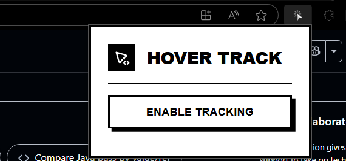
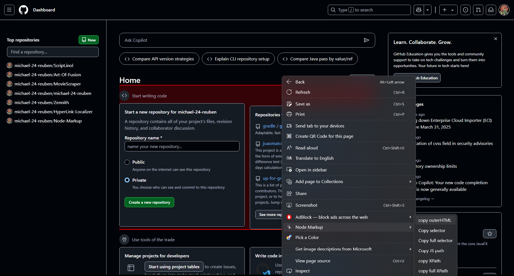

# Element Copy Extension

This Edge / Chrome extension allows users to right-click on elements on a webpage to copy various information about them, such as the element's outer HTML, selector, XPath, and JavaScript path. It also provides a visual indication for the selected element and shows a popup confirming successful copying.

## Features

- **Copy Element Information**: Right-click on any element to copy its:
    - Outer HTML
    - CSS Selector
    - Full Selector
    - JavaScript Path
    - XPath
    - full XPath
- **Popup Notifications**: A popup message appears confirming the success or failure of the copy action.
- **Hover to Select**: The extension optionally highlights elements as you hover over them for easy selection and identification. 

## Screenshots

### Snapshot of Popup

The following image shows the popup that appears when the user successfully copies an element’s information:



### Snapshot of Hover to Select and Copy Data

This image shows how the elements are highlighted when hovering over them, and the data can be copied with a right-click:



## Installation

1. Clone the repository to your local machine:
    ```bash
    git clone https://github.com/michael-24-reuben/Node-Markup.git
    ```

2. Open Chrome and navigate to `chrome://extensions/` or `edge://extensions/` for MS Edge.

3. Enable **Developer mode** by toggling the switch in the top right corner.

4. Click the **Load unpacked** button and select the `element-copy-extension` folder.

5. The extension will now be installed and active in your browser.

## Usage

1. **Hover and Select**: Hover over any element on a webpage, and it will be highlighted.
2. **Right-click**: Right-click on the highlighted element to bring up a context menu with options to copy:
    - **Copy outerHTML**
    - **Copy Selector**
    - **Copy Full Selector**
    - **Copy JavaScript Path**
    - **Copy XPath**
    - **Copy full XPath**
3. A popup will appear to confirm whether the copy action was successful or failed.

## Development

If you want to contribute or modify the extension, follow these steps:

1. Clone the repository to your local machine.
2. Make your changes.
3. Test your changes locally by loading the extension in Chrome as described in the **Installation** section.
4. Once satisfied, submit a pull request with a description of the changes.

## License

This project is licensed under the MIT License - see the [LICENSE](LICENSE) file for details.

